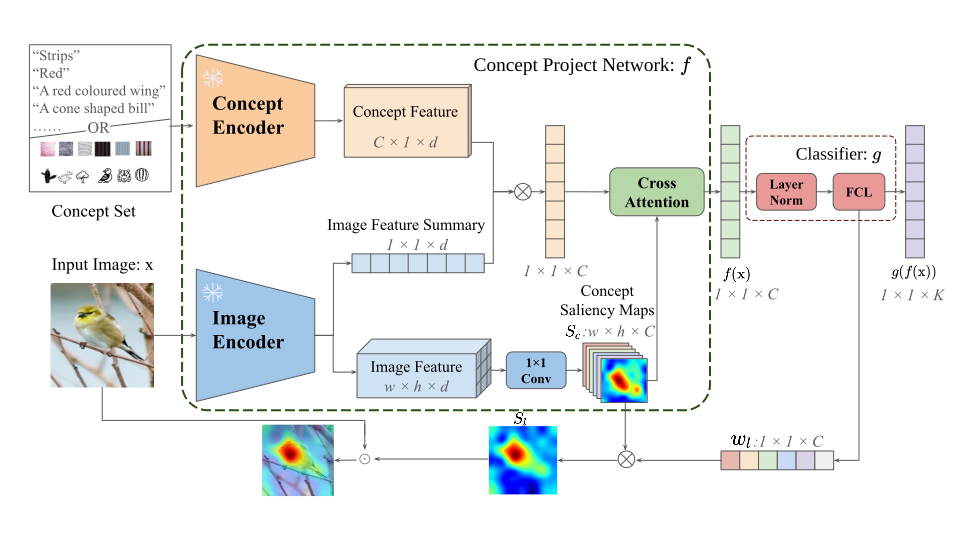

# SL-CBM: Enhancing Concept Bottleneck Models with Semantic Locality for Better Interpretability

This repository contains the official implementation of *SL-CBM: Enhancing Concept Bottleneck Models with Semantic Locality for Better Interpretability* (AAAI 2026).

## Abstract
Explainable AI (XAI) is crucial for building transparent and trustworthy machine learning systems, especially in high-stakes domains. Concept Bottleneck Models (CBMs) have emerged as a promising ante-hoc approach that provides interpretable, concept-level explanations by explicitly modeling human-understandable concepts. However, existing CBMs often suffer from poor locality faithfulness, failing to spatially align concepts with meaningful image regions, which limits their interpretability and reliability. In this work, we propose SL-CBM (CBM with Semantic Locality), a novel extension that enforces locality faithfulness by generating spatially coherent saliency maps at both concept and class levels. 
## Overview

The high-level framework of SL-CBM is illustrated below:


 Given an input image $\mathbf{x}$, a concept set, the fixed concept and image encoders extract concept and image features, and an image feature summary. Projecting the image summary onto concept features yields a similarity vector. A $1 \times 1$ convolution generates concept saliency maps $S_\mathbf{c}$, which, with the similarity vector, are refined via cross-attention into  $f(mathbf{x})$. preserving locality and concept relevance. A classifier then produces logit $g(f(mathbf{x}))$, and class saliency map $S_l$ is computed by weighting $S_\mathbf{c}$ with the class-specific FCL weight $\mathbf{w}_l$.

## Installation

WIP

## Quick Start

WIP

## Citation

If you find this work useful in your research, please cite:

```bibtex
@misc{zhang2026slcbm,
  title         = {SL-CBM: Enhancing Concept Bottleneck Models with Semantic Locality for Better Interpretability},
  author        = {Hanwei Zhang and Luo Cheng and Rui Wen and Yang Zhang and Lijun Zhang and Holger Hermanns},
  year          = {2026},
  eprint        = {2601.12804},
  archivePrefix = {arXiv},
  primaryClass  = {cs.AI},
  url           = {https://arxiv.org/abs/2601.12804}
}
```

## License

This project is released under the [MIT License](LICENSE).
