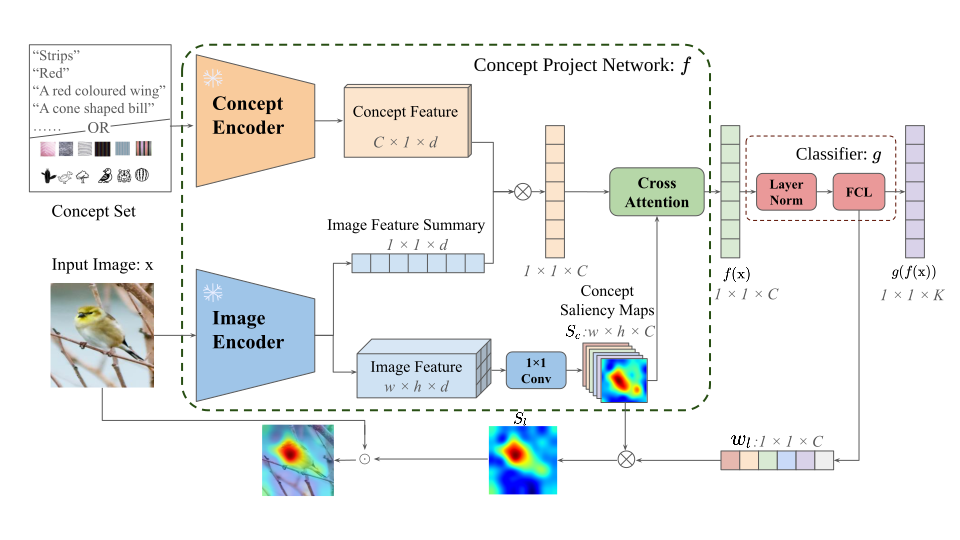

# SL-CBM: Enhancing Concept Bottleneck Models with Semantic Locality for Better Interpretability

This repository contains the official implementation of *SL-CBM: Enhancing Concept Bottleneck Models with Semantic Locality for Better Interpretability* (AAAI 2026).

## Abstract
Explainable AI (XAI) is crucial for building transparent and trustworthy machine learning systems, especially in high-stakes domains. Concept Bottleneck Models (CBMs) have emerged as a promising ante-hoc approach that provides interpretable, concept-level explanations by explicitly modeling human-understandable concepts. However, existing CBMs often suffer from poor locality faithfulness, failing to spatially align concepts with meaningful image regions, which limits their interpretability and reliability. In this work, we propose SL-CBM (CBM with Semantic Locality), a novel extension that enforces locality faithfulness by generating spatially coherent saliency maps at both concept and class levels. 
## Overview

The high-level framework of SL-CBM is illustrated below:


 Given an input image $\mathbf{x}$, a concept set, the fixed concept and image encoders extract concept and image features, and an image feature summary. Projecting the image summary onto concept features yields a similarity vector. A $1 \times 1$ convolution generates concept saliency maps $S_\mathbf{c}$, which, with the similarity vector, are refined via cross-attention into  $f(\mathbf{x})$. preserving locality and concept relevance. A classifier then produces logit $g(f(\mathbf{x}))$, and class saliency map $S_l$ is computed by weighting $S_\mathbf{c}$ with the class-specific FCL weight $\mathbf{w}_l$.


## Installation

Conda is required. We recommend creating the environment from the provided `environment.yml` (Python 3.12, PyTorch 2.6+cu124, and all pip dependencies):

```bash
conda env create -f environment.yml
conda activate env_pcbm_base
```

Install the following packages from GitHub (RIVAL10 dataset loader and PCBM utilities):

```bash
pip install git+https://github.com/uzukidd/RIVAL10.git@minimalist
pip install git+https://github.com/uzukidd/pcbm-module.git
```

- [RIVAL10](https://github.com/uzukidd/RIVAL10): minimalist RIVAL10 dataset (fork of [mmoayeri/RIVAL10](https://github.com/mmoayeri/RIVAL10)).
- [pcbm-module](https://github.com/uzukidd/pcbm-module): PCBM helper package.

## Dataset Configuration Guide
Configure the dataset paths in in `utils/constants.py`

```python
class dataset_constants:
    ...
    CIFAR10_DIR:str = ...
    CIFAR100_DIR:str = ...
    CUB_DATA_DIR:str = ...
    CUB_PROCESSED_DIR:str = ...
    CELEBA_DIR:str = ...
    RIVAL10_DIR:str = ...
    ...
```

| Dataset | Link |
| :--- | :--- 
| **CIFAR-10 / 100** | No manual download needed; the code will auto-download via `torchvision` to the `data/` folder. |
| **CUB-200-2011** | [https://www.vision.caltech.edu/datasets/cub_200_2011/](https://www.vision.caltech.edu/datasets/cub_200_2011/) |
| **CelebA** | [https://mmlab.ie.cuhk.edu.hk/projects/CelebA.html](https://mmlab.ie.cuhk.edu.hk/projects/CelebA.html) |
| **RIVAL10** | [https://github.com/mmoayeri/RIVAL10](https://github.com/mmoayeri/RIVAL10) |
---
## Download Checkpoints and Concept Banks

Model assets and prepackaged archives are hosted on Google Drive. Please follow the steps below to set up your environment:

1. **Download**: Obtain the following files from this [Google Drive Folder](https://drive.google.com/drive/folders/1ZkWL_zJB_j2kI42sqFSq1rGhevHc-cVi?usp=sharing):
   * `concept_banks.zip`
   * `data_ckpt.zip`

2. **Extract**: Unzip both archives into the **project root directory** (`.`):
   ```bash
   unzip concept_banks.zip -d .
   unzip data_ckpt.zip -d .
## Quick Start

Reproduce key experiments on the RIVAL-10 dataset

- **PCBM (ResNet-50)**  

  ```bash
  bash scripts/RIVAL_10/attr_align_eval/RN50_eval.sh
  ```

- **PCBM (ViT-B/16)**  

  ```bash
  bash scripts/RIVAL_10/attr_align_eval/ViT-B-16-laion_eval.sh
  ```

- **CSS-CBM (ViT-B/16)**  

  ```bash
  bash scripts/RIVAL_10/css_vl_cbm/css_vl_cbm_train_simple_concepts.sh
  ```

- **SL-CBM (ours)**  

  ```bash
  bash scripts/RIVAL_10/spss_vl_cbm/spss_vl_cbm_train_simple_concepts_with_lambda.sh 1.0 1.0 5.0
  ```

## Citation

If you find this work useful in your research, please cite:

```bibtex
@misc{zhang2026slcbm,
  title         = {SL-CBM: Enhancing Concept Bottleneck Models with Semantic Locality for Better Interpretability},
  author        = {Hanwei Zhang and Luo Cheng and Rui Wen and Yang Zhang and Lijun Zhang and Holger Hermanns},
  year          = {2026},
  eprint        = {2601.12804},
  archivePrefix = {arXiv},
  primaryClass  = {cs.AI},
  url           = {https://arxiv.org/abs/2601.12804}
}
```

## License

This project is released under the [MIT License](LICENSE).
